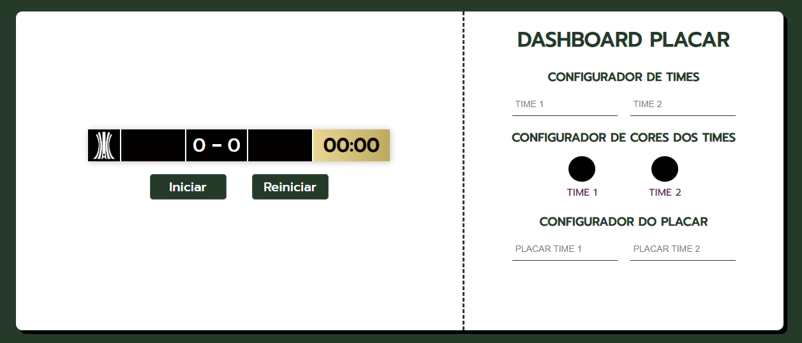

# Placar Conmebol Liberdadores
O Placar Libertadores é uma aplicação web simples que exibe o placar de um jogo da Copa Libertadores.

## 🖥️ Tecnologias utilizadas:
O Bikcraft mini foi construído usando as seguintes tecnologias:

- HTML5
- CSS3
- Javascript

## ⤵️ Funcionalidades atuais
A versão atual do Placar Libertadores exibe o placar de um jogo entre duas equipes. As funcionalidades incluem:

- Exibição do logotipo da Libertadores.
- Exibição e personalização dos nomes das equipes.
- Exibição do placar com o número de gols de cada equipe.
- Exibição do tempo atual da partida.

## ⚙️ Como usar
Abra o arquivo `index.html` em um navegador web compatível.
O placar do jogo será exibido no centro da página.

## ⭐ Contribuição:
Se você quiser contribuir para o projeto, fique a disposição. Caso veja algum problema, não deixe de reportar.

## 👮🏻‍♀️ Licença:
Projeto Open source.
